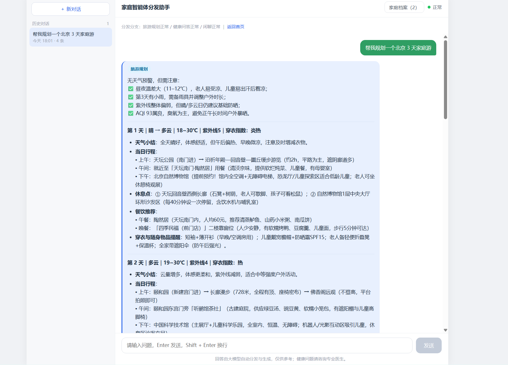

# FamilyAgent 家庭智能体

面向家庭的日常助手：**你只管提一个问题，它自己判断该找谁**。系统先用大模型识别意图，再转发给对应的智能体——旅游规划、健康问答，其余交给通用大模型闲聊。

`Python 3.12` · `FastAPI` · `LangChain / LangGraph` · 通义千问（阿里云百炼）· DashVector 向量检索 · 和风天气

---

## 功能特性

| 能力 | 说明 |
|---|---|
| **意图自动分发** | 识别「旅游规划 / 健康问答 / 闲聊」三类，识别失败或不确定时兜底为闲聊，永不抛异常 |
| **旅游规划智能体** | 专为「老人 + 儿童」家庭设计 3 天路线，回答前会拉取目的地**实时天气**：3 日预报、生活指数、空气质量、气象预警，并据此给出穿衣与出行建议 |
| **健康问答智能体** | 先查**本地权威知识库**（RAG）再作答；检索不到时才用模型自身知识，且**强制在回答开头加免责标注**，避免把生成内容伪装成知识库内容 |
| **多轮记忆** | 会话逐轮落盘（`familyagent/history/`），刷新页面后左侧栏仍能看到历史对话，点开即可接着聊；追问会自动延续上一轮的话题 |
| **家庭档案** | 录入家人的基础信息（关系、年龄、慢病、过敏、用药、忌口等），提问时自动挑出相关成员注入提示词，**并在回答开头写明这次参考了谁**（`> 📋 本次回答参考了家庭档案：奶奶、宝宝`） |
| **流式输出** | 回答逐段返回，前端边收边渲染 Markdown，首字延迟低 |
| **单一前端入口** | 一个页面搞定：分发结果标签、档案说明条、免责提示条、历史侧边栏、家庭档案管理弹窗 |

> 健康相关内容由大模型生成，仅供参考，不能替代医生诊断。

---

## 界面预览



左侧是历史会话（标题取首条提问，可删除）；顶部「家庭档案（2）」打开档案管理弹窗；回答上方依次是**分发结果标签**（本次命中的分支）、**档案说明条**（这次参考了哪几位家人）与「返回首页」入口；正文是流式渲染的 Markdown。

---

## 快速开始

### 1. 环境要求

- Python **3.12+**
- [uv](https://docs.astral.sh/uv/)（仓库自带 `uv.lock`，推荐）或自备虚拟环境
- 阿里云百炼 API Key（大模型 + 嵌入模型共用）
- 阿里云 DashVector 实例（健康知识库向量存储）

### 2. 安装依赖

```bash
git clone <你的仓库地址>
cd FamilyAgent
uv sync            # 按 uv.lock 创建 .venv 并装好全部依赖
python test.py     # 环境自检：确认依赖都装齐了（应打印「所有库都安装成功并可正常导入！」）
python -m tests.test_routes   # 可选：跑一遍离线自测，不需要任何 API Key
```

### 3. 配置环境变量

```bash
cp .env.example .env    # Windows: copy .env.example .env
```

**必填 3 项**，缺任意一项服务启动时会直接抛 `ValidationError`：

| 变量 | 说明 | 获取地址 |
|---|---|---|
| `DASHSCOPE_API_KEY` | 百炼 API Key，LLM 与嵌入模型共用 | <https://bailian.console.aliyun.com/> |
| `DASHVECTOR_API_KEY` | DashVector API Key | <https://dashvector.console.aliyun.com/> |
| `DASHVECTOR_ENDPOINT` | DashVector 集群 Endpoint | 同上 |

其余变量都有默认值（例如集合名默认 `familyagent`，不存在会自动创建；和风天气留空则自动降级为不查天气），完整清单见 `.env.example` 与 `familyagent/config.py`。

> **DashVector 白名单**：集群控制台要把你的出口 IP 加入白名单（或临时设为 `0.0.0.0`），否则检索时报 `Cluster whiteList validate fail`。

### 4. 初始化健康知识库（健康问答必需）

知识库是 `data/health_knowledge.csv`（列：`title,category,content`），需要先向量化写入 DashVector：

```bash
python -c "from familyagent.func.vector_db_func import init_vector_db; init_vector_db()"
```

- 重跑是**幂等**的：分块按内容 md5 作主键，重复执行是覆盖而不是新增。
- 想清空重来：加参数 `init_vector_db(recreate=True)`。
- 换成自己的知识库：替换 CSV（保持三列）后重新执行上面的命令即可。
- 入库后索引是异步构建的，脚本会等到索引就绪再返回（最长等 30 秒）。

### 5. 启动

```bash
python -m familyagent     # 已激活虚拟环境时
uv run python -m familyagent   # 用 uv 时（无需手动激活）
```

端口、监听地址、热重载都由 `.env` 控制（默认 `0.0.0.0:8000`，热重载开启）。

打开 <http://127.0.0.1:8000/agent/> 即前端页面（根路径 `/` 是服务状态页，`/docs` 是 Swagger 文档）。

---

## 使用示例

打开页面后可以直接试这几句：

| 输入 | 走到哪个分支 |
|---|---|
| 帮我规划一个适合奶奶和宝宝的北京三日游 | 旅游规划（叠加实时天气） |
| 那第二天换成室内的吧 | 延续上一轮的**旅游规划**，并沿用上一轮的档案 |
| 奶奶血压高，平时饮食要注意什么？ | 健康问答（命中知识库则不带免责标注） |
| 宝宝起湿疹怎么护理？ | 健康问答 |
| 讲个笑话吧 / 谢谢 | 闲聊（纯问候不会硬拉档案进来） |

页面右上角「**家庭档案**」录入家人信息后，再问「奶奶能吃海鲜吗」，回答开头就会出现「本次回答参考了家庭档案：奶奶」。

---

## 接口一览

| 方法 | 路径 | 说明 |
|---|---|---|
| GET | `/` | 服务状态页（各智能体可用性 + 页面/文档入口） |
| GET | `/agent/` | **前端页面**（全站唯一入口） |
| POST | `/agent/stream/` | **智能体分发**（推荐接入点）：请求体 `{"question": "...", "session_id": "s_xxx 或省略"}`，流式返回纯文本 |
| POST | `/agent/healthy/stream/` | 健康问答直达：请求体 `{"query": "..."}`，无会话与档案注入 |
| POST | `/agent/travel/stream/` | 旅游规划直达：请求体 `{"query": "..."}` |
| GET / POST | `/agent/family/` | 家庭档案：列表（含表单字段定义）/ 新增 |
| PUT / DELETE | `/agent/family/{profile_id}` | 编辑 / 删除指定家人 |
| GET | `/agent/history/` | 历史会话摘要列表（侧边栏用） |
| GET / DELETE | `/agent/history/{session_id}` | 会话详情 / 删除会话 |
| GET | `/docs`、`/redoc` | Swagger UI / ReDoc |

`POST /agent/stream/` 的响应头带两个关键信息：

- `X-Session-Id`：本轮会话 id（首轮不传 `session_id` 时由后端新建并回传，后续每轮带上即可续上上下文）
- `X-Intent`：命中的分支（中文，已做百分号编码，前端 `decodeURIComponent` 还原）

```bash
curl -X POST http://127.0.0.1:8000/agent/stream/ \
  -H "Content-Type: application/json" \
  -d '{"question": "帮我规划一个适合奶奶和宝宝的北京三日游"}' -i
```

---

## 项目结构

```
FamilyAgent/
├── familyagent/
│   ├── __main__.py            # 服务入口：注册路由、根状态页、启动 uvicorn
│   ├── config.py              # 全部配置项（pydantic-settings 读 .env）
│   ├── func/                  # 业务能力（无 HTTP 依赖）
│   │   ├── intent_recognition.py   # 意图识别（三分类，带兜底）
│   │   ├── agent_travel.py         # 旅游规划智能体 + 和风天气工具
│   │   ├── agent_health.py         # 健康问答智能体
│   │   ├── tool_health.py          # 健康知识检索 Tool（封装向量检索）
│   │   ├── vector_db_func.py       # CSV -> 分块 -> 嵌入 -> DashVector 入库与检索
│   │   ├── embedding_func.py       # 嵌入模型
│   │   ├── llm_config.py           # 全局 LLM 实例
│   │   ├── history_store.py        # 对话历史持久化（一个会话一个 JSON）
│   │   └── family_profile.py       # 家庭档案 CRUD、挑选与提示词注入
│   ├── route/                 # FastAPI 路由层
│   │   ├── dispatch_route.py       # 分发助手（GET /agent/ + POST /agent/stream/）
│   │   ├── health_route.py         # POST /agent/healthy/stream/
│   │   ├── travel_route.py         # POST /agent/travel/stream/
│   │   ├── family_route.py         # /agent/family/ 家庭档案增删改查
│   │   └── history_route.py        # /agent/history/ 历史会话
│   ├── templates/index.html   # 唯一前端页面（Vue 3 + marked + DOMPurify，单文件）
│   ├── test/                  # 本地自测脚本（见「测试」，未纳入版本库）
│   ├── history/               # 运行时生成：对话历史（未纳入版本库）
│   └── familydata/            # 运行时生成：家庭档案（未纳入版本库）
├── tests/                     # 功能自测（离线，随仓库发布，见「测试」）
├── test.py                    # 依赖自检：确认三方包都装齐（见「测试」）
├── data/health_knowledge.csv  # 健康知识库源文件（title,category,content）
├── docs/screenshots/chat.png  # README 配图
├── .env.example               # 环境变量模板
├── LICENSE                    # MIT
└── pyproject.toml / uv.lock   # 依赖与锁定版本
```

---

## 一次问答的完整链路

```
浏览器  ──POST /agent/stream/  {question, session_id?}──▶  dispatch_route
                                                            │
        ① 取会话：history_store.get_or_create_session
           └─ 取最近 12 条消息作为上下文（会话不存在则新建，id 回传 X-Session-Id）
                                                            │
        ② 并发两件互不依赖的事（首字延迟只等于较慢的那个）
           ├─ 意图识别 recognize_intent（附最近对话摘要，用于判断追问归属）
           └─ 档案挑选 select_profiles（先按称呼直连匹配，未命中才问模型）
                                                            │
        ③ 按意图分发
           ├─ 旅游规划 ─▶ agent_travel（先调 get_weather 拿实时天气）
           ├─ 健康问答 ─▶ agent_health（先调 health_knowledge_search 查知识库）
           └─ 其  他   ─▶ 通用大模型（闲聊人设）
           └─ 档案文本块 + 历史 + 当前问题 一起作为用户输入注入
                                                            │
        ④ 流式返回：开头一行「本次回答参考了家庭档案：…」，随后是正文
           └─ finally：整轮问答（含命中的意图与档案）落盘到 history/
```

设计取舍：档案块拼在**用户输入**而不是系统提示词里，这样两个智能体可以长期复用同一个 agent 实例；历史与档案都是「给模型补上下文」，所以拼装逻辑统一放在 `family_profile.build_agent_messages()`。

---

## 测试

项目里有**三类**「测试」，作用不同，别混淆。

### 功能自测：`tests/`（随仓库发布，**不需要任何 API Key**）

```bash
python -m tests.test_history_store
python -m tests.test_family_profile
python -m tests.test_intent_recognition
python -m tests.test_routes
```

| 脚本 | 覆盖内容 |
|---|---|
| `tests/test_history_store` | 会话增删改查、上下文拼装、**非法会话 id 拒绝**、坏文件容错、原子写 |
| `tests/test_family_profile` | 档案增删改查、字段校验与边界值、称呼直连与模型判断两条选择链路、提示词注入格式 |
| `tests/test_intent_recognition` | 三类标签的解析容错、追问上下文注入、异常/空回复/空输入兜底 |
| `tests/test_routes` | 页面渲染、接口路径全集、档案与会话接口、三个分支分发正确、空问题短路、档案注入与多轮沿用 |

设计取向是**离线可复现**：需要模型的地方一律换成假 LLM，数据写到临时目录，所以跑起来**不联网、不产生 API 费用、不碰** `familyagent/history/` 与 `familyagent/familydata/` 里的真实数据。

> 没配 `.env` 也能直接跑：`tests/__init__.py` 会在导入 `familyagent` 之前给三个必填项补上占位值；一旦检测到 `.env` 存在就什么都不做，绝不覆盖真实配置。

### 环境自检：`test.py`

确认依赖是否装齐。它只做一件事——把项目用到的三方包逐个 `import` 一遍：

```bash
python test.py
# 解释器：D:\WorkSpace\FamilyAgent\.venv\Scripts\python.exe
# Python：3.12.4
# 所有库都安装成功并可正常导入！
```

会打印当前解释器路径（排查「装到了别的 Python 里」这类问题很方便），缺包则直接抛 `ModuleNotFoundError`。刚克隆仓库、换机器、重装依赖之后建议先跑这个。

> 它校验的 `python-dotenv` 不是本项目直接声明的依赖，而是随 `pydantic-settings` 一起装进来的（`config.py` 用它读 `.env`）。放在自检里是为了确认这条间接依赖链完整。

### 本地联调脚本：`familyagent/test/`

**该目录已加入 `.gitignore`，不随仓库发布**（脚本里含真实提问与个人化用例），克隆仓库后需按需自行补建。运行方式：

```bash
python -m familyagent.test.test_xxx
```

与上面的区别是它**会真的调用大模型、向量库与天气接口**，用来验证「钥匙配得对不对、链路通不通」：

| 脚本 | 覆盖内容 | 依赖 |
|---|---|---|
| `test_config` | 配置自检（打印脱敏后的 Key、模型、端口） | 仅读 `.env` |
| `test_llm` | LLM 连通性 | 真实 API |
| `test_embedding` | 嵌入模型维度与返回 | 真实 API |
| `test_vecoror_db` | 向量库创建、写入、检索 | 真实 API |
| `test_rag` | RAG 全链路：入库 → 检索（有/无结果） | 真实 API |
| `test_tool` | 健康知识检索 Tool | 真实 API |
| `test_agent_health` | 健康问答智能体（含知识库命中与兜底） | 真实 API |
| `test_agent_travel` | 旅游智能体 + 天气工具直调 | 真实 API |
| `test_intent_recognition` | 三分类识别（含真实模型）+ 解析容错 + 异常兜底 | 真实 API + 假 LLM |
| `test_history_store` | 会话 CRUD、上下文拼装、非法 id 拒绝、坏文件容错 | 离线 |
| `test_family_profile` | 档案 CRUD、字段校验、匹配与选择链路、格式化 | 离线（假 LLM） |

改完代码先跑 `tests/`（快、免费、可复现），需要确认外部服务真的通时再跑 `familyagent/test/`。

---

## 数据与隐私

- `.env`、`familyagent/history/`、`familyagent/familydata/` 均已加入 `.gitignore`，**不会进版本库**。
- 对话历史与家庭档案**只保存在本机**，但请注意：**提问内容、命中的家庭档案会随请求发送给阿里云百炼**（用于生成回答与向量检索），不会发给其他第三方。
- 服务默认监听 `0.0.0.0` 且**没有任何鉴权**，同一局域网内的任何设备都能访问页面并读取家庭档案。只在本机使用请把 `APP_HOST` 改为 `127.0.0.1`；需要多人访问请自行加一层鉴权或反向代理。
- 健康知识库里的内容会作为提示词的一部分发给大模型，不要在 CSV 里放个人隐私。

---

## 常见问题

| 现象 | 原因与处理 |
|---|---|
| 启动报 `ValidationError: 3 validation errors for Config` | 缺必填项，检查 `.env` 里 `DASHSCOPE_API_KEY`、`DASHVECTOR_API_KEY`、`DASHVECTOR_ENDPOINT` |
| 健康回答不引用知识库内容 | 知识库没入库（执行第 4 步），或 DashVector 白名单未放通，或索引尚未就绪 |
| 报 `Cluster whiteList validate fail` | DashVector 控制台把你的 IP 加入白名单（或临时设 `0.0.0.0`） |
| 天气工具返回「未配置」提示 | `WEATHER_API_KEY` / `WEATHER_API_HOST` 未填，属正常降级，其余功能不受影响 |
| 页面样式或交互异常、控制台报 Vue 未定义 | 前端三个库走 unpkg CDN，离线/内网环境需改成本地文件（见「已知限制」） |
| Windows 终端中文日志乱码 | 设置 `PYTHONIOENCODING=utf-8`（或 `chcp 65001`）后重启服务 |

---

## 已知限制

- **单用户、无鉴权**：适合本机或家庭内网，不适合直接暴露到公网。
- **文件锁只在单进程内有效**：历史与档案用 `threading.Lock` 保护写入，不要用 `uvicorn --workers N`（N>1）多进程部署。
- 每个问题会额外产生一次意图识别调用（与档案挑选并发，不叠加首字延迟）；这是「自动分发」的固有成本。
- 前端依赖 CDN（Vue / marked / DOMPurify），没有做本地打包。
- 示例知识库只有 4 条，实际使用请替换为自己的内容。
- 历史会话无分页与按关键词搜索；档案中的日期字段（`created_at` / `updated_at`）为本地时间字符串。

---

## 免责声明

本项目中的健康问答内容由大模型与本地知识库自动生成，**仅供日常护理参考，不能替代专业医疗诊断**。出现紧急症状请立即就医。

---

## License

[MIT](LICENSE) © 2026 Arrivederci14
